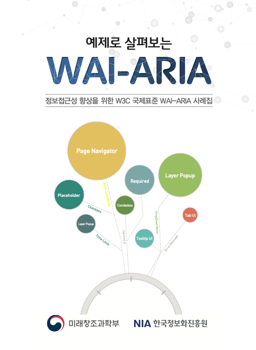

# 멋쟁이사자처럼 웹 프론트엔드 부트캠프 15기 WAI-ARIA 스터디

> 스터디 교재 - 예제로 살펴보는 WAI-ARIA

## 스터디 계획

### 10/1(수) 부터 시작, 매주 수요일 (혹은 조율하여 정한 요일)

### 주차 별 진도

| 주차  | 범위            | 세부 내용                                                                 |
|-------|-----------------|--------------------------------------------------------------------------|
| 1주차 | 1장 개요        | WAI-ARIA 소개, Roles/States/Properties, How to Use, Landmark Role, Live Region |
| 2주차 | 2장 사례집 1–3  | 탭, 자동완성, ID/PASSWORD 입력서식                                       |
| 3주차 | 2장 사례집 4–6  | 다중 폼, 버튼, 라디오버튼                                                |
| 4주차 | 2장 사례집 7–9  | 체크박스, 에러메시지, 레이어 팝업                                        |
| 5주차 | 2장 사례집 10–12| 툴팁, 필수 입력 항목, 플레이스 홀더                                      |
| 6주차 | 2장 사례집 13–15| 타임 세션, 드랍다운 메뉴, 로딩                                           |
| 7주차 | 2장 사례집 16–18| 특수기호, 폼 레이블, 페이지 내비게이션                                   |
| 8주차 | 2장 사례집 19–21| 실시간 폼 피드백, 캐러셀, 콤보박스                                      |

